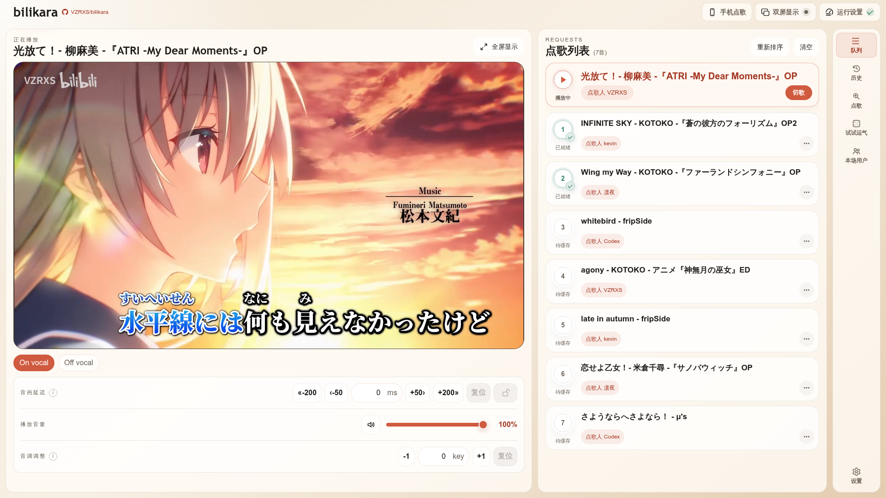
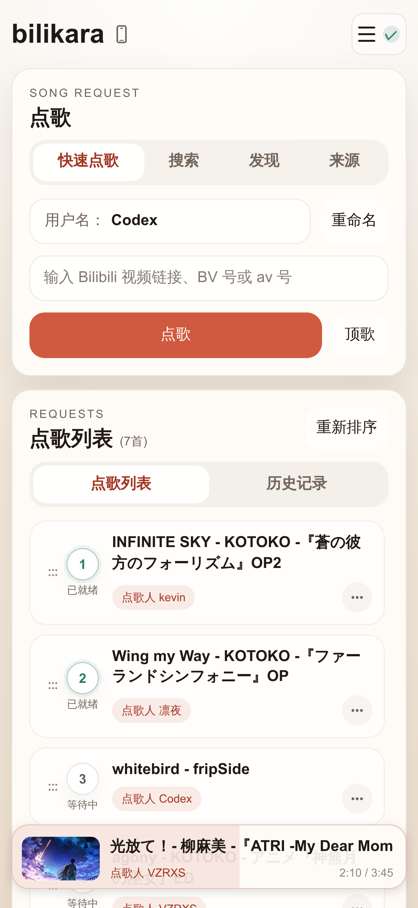
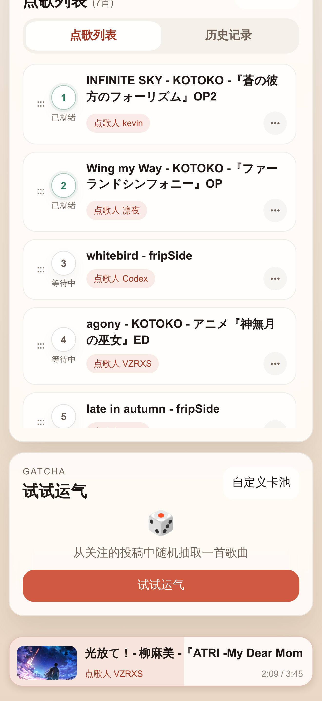
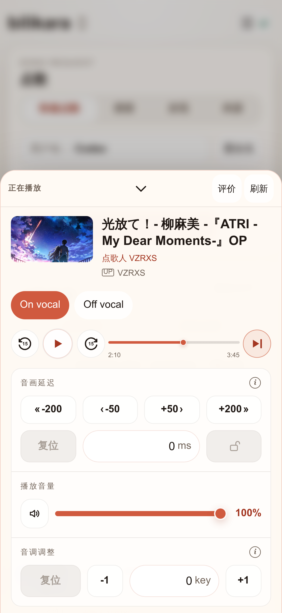
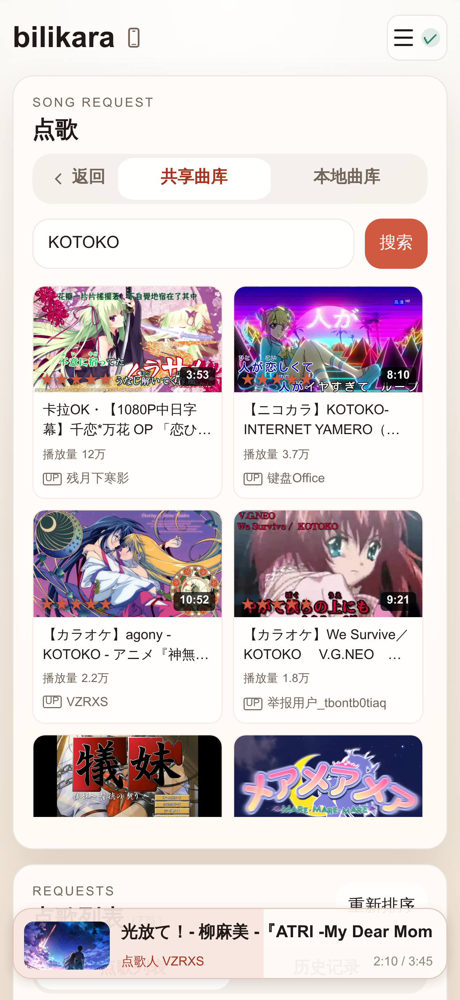
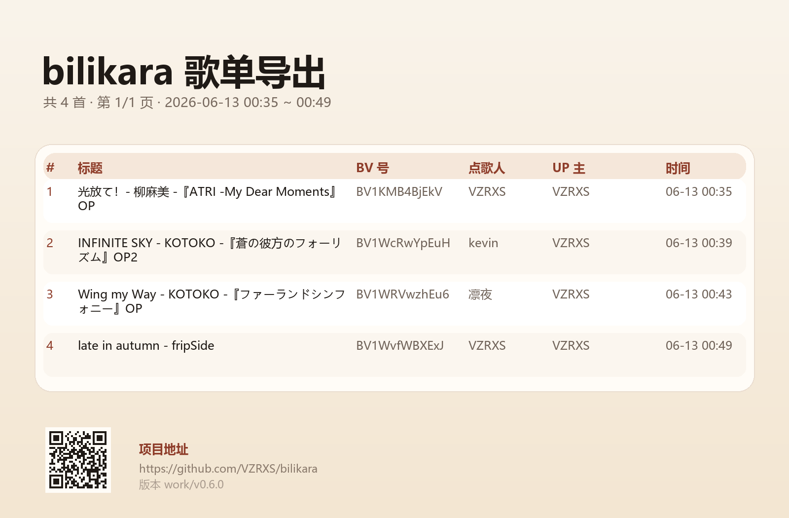
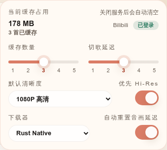
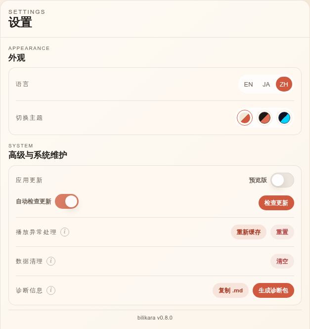
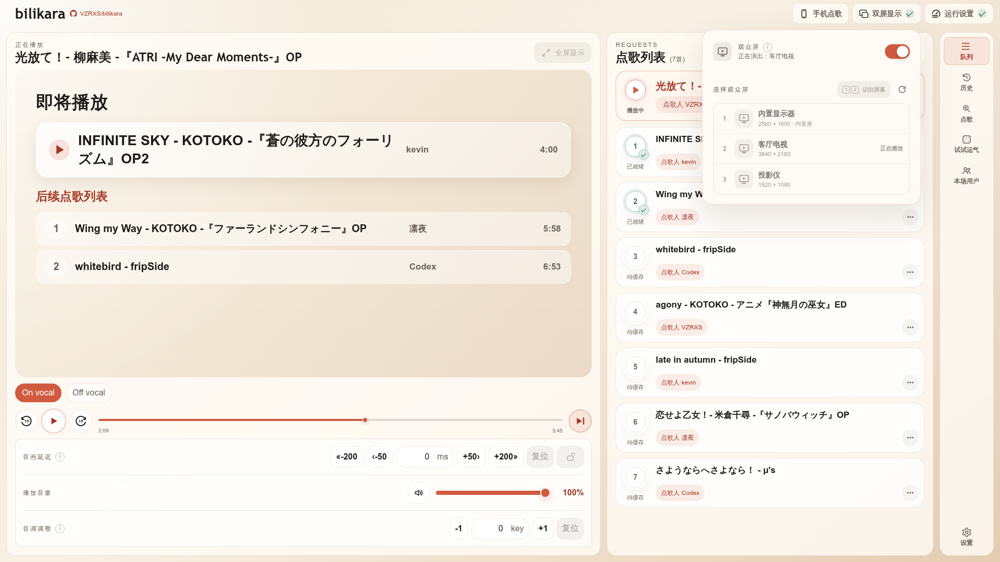
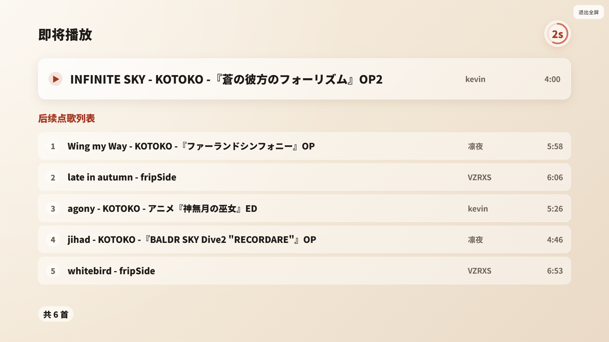

# bilikara

---

`bilikara` 是一个基于 B 站卡拉 OK 视频的点歌平台。主要由 OpenAI Codex 协助设计与实现，并经过人工整理、验证与迭代。

架构演进与后续计划见 [版本路线图](docs/version-roadmap.md)。

<p align="center">
  <br>
  <sub>Host 界面</sub>
</p>

<table>
  <tr>
    <td align="center" valign="top" width="33%">
      <br>
      <sub>移动端控制台</sub>
    </td>
    <td align="center" valign="top" width="33%">
      <br>
      <sub>点歌列表与试试运气</sub>
    </td>
    <td align="center" valign="top" width="33%">
      <br>
      <sub>播放抽屉</sub>
    </td>
  </tr>
</table>

<table>
  <tr>
    <td align="center" valign="top" width="50%">
      <br>
      <sub>共享曲库搜索</sub>
    </td>
    <td align="center" valign="top" width="50%">
      <br>
      <sub>歌曲详情</sub>
    </td>
  </tr>
</table>

## 当前版本功能

### 核心播放与缓存

- 通过 B 站视频链接或 BV 号加入点歌列表（支持链接指定分 p），后台自动进入本地缓存流程
- 默认由 Rust Native 下载并在进程内完成媒体处理；BBDown 与 DownKyi / aria2c 是相互独立的可选下载源，浏览器端使用分离视频 / 音频播放器同步播放
- 支持毫秒级音画延迟补偿、独立音量控制、静音，以及 -6 ~ +6 key 的音调调整（切歌时自动复位）
- 音量、音画延迟、切歌延迟等播放器设置会本地记忆并在重新打开后恢复
- 可设置 1 ~ 5 秒切歌延迟；切歌时显示过渡画面，包含即将播放、倒计时和后续点歌列表
- 多分 p 视频自动判断有效分 p，自动缓存多音轨，并尝试优先播放 On vocal（原唱）音轨；可随时切换音轨，切换时会同步当前播放进度与播放状态
- 加入点歌列表后自动后台缓存，缓存失败 / 长时间无变化显示重试按钮，并支持一键重试
- 缓存限制：最多只自动缓存前 1 ~ 5 首，默认 3 首，防止磁盘占用过大；服务关闭后自动清空缓存目录
- bilikara 自行生成 B 站登录二维码并轮询登录结果；确认后会将登录凭据以 UTF-8 明文、分号分隔的 Cookie 文本保存到 `<应用数据目录>/tools/bbdown/BBDown.data`，供 BBDown 下载时使用（**安全提示：** 该文件未加密，请妥善保护本机账户访问权限）

### 列表、历史与导出

- 点歌列表中展示当前播放、缓存状态和完成标记
- 支持切歌、移除、拖拽排序、顶歌到下一首等控制操作
- 本地保留歌单和播放器设置备份，重新打开后自动恢复，支持手动清空备份
- 保留点歌历史记录（次数、时间、点歌人），支持从历史记录中快速重新点歌，也可删除单曲在历史记录和本场记录中的条目
- 维护本次点歌记录：同一首歌在本次已点过时，加入前会弹窗确认
- 在历史记录页面可以导出本场记录或全部历史为 CSV 或 PNG 歌单图片；图片每页歌曲数可选 50 ~ 200 首；PNG 优先使用应用内置的 Source Han Sans，使中文、日文、拉丁字符和数字排版更一致，不支持的符号和 emoji 仍会使用后备字体
- 自动保存对应视频的 UP 主信息，悬停列表或历史记录时可显示完整歌名与 UP 主信息
- 按场次单独保存“本次已唱”记录（JSON 格式），便于扩展读取接口
- 设置本场用户，可通过拖拽或列表排序管理点歌人顺序

<p align="center">
  <br>
  <sub>歌单导出图片</sub>
</p>

### 试试运气与本地来源

- 登录 Bilibili 后，可从配置的 UP 主投稿中随机抽取歌曲，查看结果后点歌、顶歌，或再试一次；未登录时显示提示并禁用抽取按钮
- 在「自定义卡池」中管理 UP 主和收藏夹来源，支持查看、添加、移除和刷新来源
- 按 UP 主或收藏夹浏览已收录的稿件，也可在「本地曲库」搜索本地缓存的来源数据
- 来源更新时筛选符合卡拉 OK 条件的稿件并保存索引；本地索引是歌曲信息，不等同于已下载的播放媒体
- 新收录的 BV 号可参与共享曲库共建；视频打分窗口中的「添加 UP 主到本地列表」用于管理本地来源，不会代替你在 B 站关注账号

### 共享曲库（Cloudflare D1 后端）

- 共享曲库共建：多用户点歌与拉取收藏夹时，新增的 BV 号自动去重汇总上传，实现曲库共建
- 远程搜索：快速搜索共享曲库中已收录的丰富稿件
- 分类索引浏览：
  - 按作品名 / 歌手名首字母（或假名）索引快速定位浏览
  - 按前端内置的约 40 个主题类别（热血、百合、VOCALOID、偶像、异世界等）进行浏览，并附带专属类别封面图
  - 按已导入的收藏夹目录浏览对应稿件
- LLM 数据自动标注：曲库定期使用大语言模型（LLM）对稿件进行标签（Tag）和拼音读音（Yomi）的智能化标注，大幅提升首字母定位与类别浏览体验

### 评价系统（Rating）

- 对已播放的歌曲支持进行 1 ~ 5 星匿名评分
- 评分数据提交至远程 D1 数据库并自动同步至 Google Sheets 备份，在云端计算稿件的平均分
- 在远程搜索和历史结果中展示评分人数与平均分

<p align="center">
  <br>
  <sub>视频打分窗口</sub>
</p>

### 控制、设置与界面体验

- 同一局域网内手机端控制台支持：
  - 查看和调整点歌列表
  - 远程暂停 / 播放、前后跳转 15 秒、切歌
  - 切换音轨、调节音量、音画延迟、升降 key
- 移动端播放控制：
  - 底部播放栏显示当前歌曲、点歌人和进度，点击后展开播放抽屉
  - 快速点歌、共享曲库 / 本地来源搜索、发现与来源浏览通过标签页切换
  - 局域网可直接连接；开启公网房间后，也可使用公网 Remote 入口与房间密码连接
- 新点歌提示：Host 端全屏播放中收到新请求时，会在左上角弹出提示
- 运行设置：
  - 查看缓存占用，调整自动缓存数量
  - 调整默认清晰度、Hi-Res 优先、切歌延迟
  - 管理 Bilibili 登录，选择 Rust Native、BBDown 或 DownKyi / aria2c 下载器
  - 数据清理、重新缓存 / 重置播放器和应用更新检查
  - 可复制经过脱敏的诊断 Markdown，并生成可下载的诊断包；诊断采集会限制日志与导出记录范围，并遮蔽凭据和本地用户名
  - 源码脚本运行时，更新检查会跳转 GitHub Releases 页面；打包版运行时会自动下载更新并重启服务
- 设置：
  - Host 使用常驻播放区与侧边工作区，切换队列、历史、点歌、试试运气、本场用户和设置时保持播放
  - 主题：浅橙 / 黑橙 / 黑蓝主题
  - 语言：中文（zh）/ 英文（en）/ 日文（ja）
  - Host 和 Remote 会分别记忆偏好

<table>
  <tr>
    <td align="center" valign="top" width="50%">
      <br>
      <sub>运行设置</sub>
    </td>
    <td align="center" valign="top" width="50%">
      <br>
      <sub>设置</sub>
    </td>
  </tr>
</table>

### 全屏播放与双屏显示

全屏播放时，将光标悬浮在右上角的退出全屏按钮上，即可显示手机点歌二维码。收到新点歌请求时，左上角会显示歌曲提示。普通全屏与双屏显示中的观众画面均支持这些功能。

桌面版可将操作界面与观众画面分开：主屏保留 Host 点歌、队列和播放控制，扩展屏全屏显示视频，适合连接电视或投影仪。

1. 连接扩展屏，在 Host 右上角打开「双屏显示」。
2. 选择操作屏与播放屏并启用；主屏显示当前播放进度与后续歌单，播放屏显示视频画面。
3. 仍可通过手机 Remote 点歌和控制播放；结束时退出双屏显示，恢复单屏使用。

<table>
  <tr>
    <td align="center" valign="top" width="50%">
      <br>
      <sub>操作屏：队列与播放控制</sub>
    </td>
    <td align="center" valign="top" width="50%">
      <br>
      <sub>全屏播放：二维码与新点歌提示</sub>
    </td>
  </tr>
</table>

<p align="center">
  <br>
  <sub>切歌过渡画面</sub>
</p>

## 启动

**桌面版（Tauri）**

带 tag 的发布版会通过 GitHub Actions 打包；在 Releases 下载对应平台的压缩包后，优先运行桌面入口：

- Windows：`bilikara-desktop.exe`
- macOS：`Bilikara-Desktop.app`

> [!IMPORTANT]
> **macOS 首次启动**
>
> 如果首次打开 `Bilikara-Desktop.app` 时 macOS 提示无法验证开发者或无法检查 App 是否包含恶意软件，请先关闭该提示，然后：
>
> 1. 打开「系统设置」→「隐私与安全性」。
> 2. 向下滚动到「安全性」，找到有关 Bilikara 被阻止打开的提示。
> 3. 点击「仍要打开」。
> 4. 如系统要求，输入当前账户的登录密码进行确认。
> 5. 警告再次出现后，点击「打开」即可启动 Bilikara。
>
> 「仍要打开」选项只会在尝试启动 App 后出现。完成一次授权后，之后可以正常双击启动。

桌面入口由 Tauri 提供窗口壳，启动时会自动拉起 Python 后端服务并打开 Host 界面；关闭桌面窗口后会请求后端退出并清理本次运行的缓存。

**迁移期间的兼容入口**

浏览器 Host 模式与独立 Python 后端入口仅作为 Rust 迁移期间的兼容入口保留，计划在完全迁移至 Rust 后淘汰。日常使用请通过桌面入口启动；此计划不影响手机浏览器中的 Remote 控制台。

Host 用于播放与管理，Remote 用于手机点歌和控制。手机与 Host 在同一局域网时，可扫描 Host 的二维码连接；公网访问则需先在 Host 创建公网房间，再使用公网 Remote 入口和房间密码连接。

**从源码启动**

源码运行也需要 Rust Domain、Rust Runtime 和原生媒体库。先安装 Python、Rust 工具链与所在平台的原生编译依赖，并按 [媒体打包说明](media-libav/PACKAGING.md) 准备 libav 及 companion；只安装 Python 并不足以启动完整播放器。Linux/macOS 源码运行需将 `BILIKARA_LIBAV_COMPANION` 指向构建出的 companion 动态库；完整平台配置请参考打包工作流。

```bash
cargo build --manifest-path rust/Cargo.toml --release --locked
cargo build --manifest-path rust-runtime/Cargo.toml --release --locked
python start_bilikara.py
```

以上源码入口用于开发与调试。Tauri 桌面入口自行管理后端进程和端口。

Host 会依据系统路由推荐局域网地址。VPN、多网卡或容器环境下，如手机无法连接，请检查监听地址、防火墙和设备所在网络，并尝试二维码面板中的备用地址。

## 本地构建与打包

桌面发行包由原生 Rust 库、libav/companion、Python 后端和 Tauri 桌面壳组成。应在目标系统及架构上构建；完整步骤以 [打包工作流](.github/workflows/ci-bundle.yml) 和 [媒体打包说明](media-libav/PACKAGING.md) 为准。

1. 安装 Python、Rust、Node.js 24（可用 `nvm use`）及目标平台的编译工具；Windows 使用 MSVC，macOS 使用 Xcode Command Line Tools。
2. 构建同源 libav 和 companion，设置绝对路径 `BILIKARA_LIBAV_PREFIX`。该目录须包含库、依赖、构建记录、源码和许可证，打包脚本会验证完整性；系统安装的 FFmpeg 命令不能代替它。
3. 构建 Python 后端：Windows 运行 `build_windows.bat`，macOS 运行 `build_macos.command`。脚本安装打包依赖并调用 `build_bundle.py`，产物位于 `dist/`。
4. 构建 Tauri 桌面壳：运行 `npm ci` 和 `npm run build`。完整发行包还需按工作流将桌面入口与后端包组装、验证并压缩；单独构建桌面壳不等于生成完整发行包。

开发桌面界面可运行 `npm ci`、`npm run dev:rust`；媒体库仍须事先准备。Node.js 和编译工具是开发构建依赖，最终用户无需安装。

- 发布包包含 Rust Native、libav/companion 和固定版本 BBDown，不包含外部 `ffmpeg` / `ffprobe`；选择 DownKyi / aria2c 时按需准备下载工具
- 静态页面、原生库及工具资源随应用打包；运行数据与日志写入可写目录
- Windows 打包版默认使用可执行文件旁的 `runtime/`；macOS 使用 `~/Library/Application Support/bilikara/`；源码运行默认使用仓库目录。可通过 `BILIKARA_HOME` 覆盖
- Windows 产物未使用代码签名证书；macOS 使用 ad-hoc 签名，首次启动可能需要按上文放行
- 后端启动排障可使用 `python build_bundle.py --console` 生成控制台版本，或查看应用数据目录下的 `data/logs/startup.log`

开发参考：[版本路线图](docs/version-roadmap.md)、[移动 Host 与共享 Rust 架构](docs/mobile-host-rust-architecture.md)、[共享曲库服务契约](docs/shared-catalog.md)。历史设计与实验记录位于 [docs/history/](docs/history/README.md)。

## 可选环境变量

一般使用优先通过界面设置。环境变量须在启动前配置，桌面入口与独立后端的适用范围有所不同。

| 变量 | 用途 |
| :--- | :--- |
| `BILIKARA_HOME` | 应用数据目录；平台默认位置见上文 |
| `BILIKARA_HOST` | 后端监听地址；源码默认 `0.0.0.0`，Windows 打包版优先使用探测到的局域网 IPv4 |
| `BILIKARA_PORT` | 独立后端端口，默认 `8080`；Tauri 启动时自行选择端口 |
| `BILIKARA_MAX_CACHE_ITEMS` | 初始自动缓存窗口，默认 `3`；已保存的缓存设置由应用管理 |
| `BILIKARA_BILIBILI_COOKIE` | 提供 Bilibili Cookie；通常建议使用界面扫码登录，勿公开或提交凭据 |
| `BB_DOWN_PATH` | 指定可信的本地 BBDown 可执行文件 |
| `ARIA2C_PATH` | 指定 DownKyi 下载源使用的 aria2c 可执行文件 |
| `BILIKARA_LIBAV_COMPANION` | Linux/macOS 源码运行使用的 companion 动态库绝对路径；发行包自行定位内置库 |
| `BILIKARA_LIBAV_PREFIX` | 原生媒体库构建、验证与打包所需的绝对路径，详见媒体打包说明 |
| `BILIKARA_STARTUP_LOG` | 设为 `1` 启用启动日志；桌面入口会自动启用 |

内部迁移、严格等价检查及旧媒体路径开关属于开发诊断用途，不作为普通运行配置推荐。开发专用 Rust Host 的启用方式与限制见版本路线图。

## 技术说明

- 前端使用原生 HTML/CSS/JS，无需前端构建步骤；Node.js 仅用于构建 Tauri 桌面壳
- Python Host 使用 Python 标准库 HTTP 服务，保留传输、Rust 快照持久化 I/O 和显式外部工具编排
- Rust AppState 是唯一可变应用状态所有者；Rust CacheRuntime 执行 Native 缓存任务，新增后端功能与业务规则在 Rust 侧实现
- 桌面版使用 Tauri v2 / Rust 作为窗口壳，负责启动后端、承载本地 WebView，并在窗口关闭时请求后端退出
- 当前桌面壳仍启动 Python Host 进程来提供 HTTP API；该进程适配 Rust 状态与服务，不另建 Python 状态权威或 Native 下载回退
- Tauri 开发配置指向 `http://127.0.0.1:8080`，实际启动时会以 `--no-browser --headless --port 0` 拉起后端，并在收到 `bilikara.ready` 事件后跳转到真实本地地址
- 播放流程以本地缓存和本地媒体播放为主；Rust Native 是默认下载源，BBDown 与 DownKyi / aria2c 是显式可选下载源
- Rust Native 由 `bilikara_runtime` 直接下载、校验并重封装媒体，以临时文件和完整 sample 校验后原子发布，视频输出使用 fast-start MP4
- 当前原生媒体链路选择 AVC/H.264 视频以及常规 AAC 或可用的 Hi-Res FLAC 音轨；高解析音频处理失败时不会静默回退到外部工具
- 媒体检查与重封装使用同源构建的 libav/companion，不需要外部 FFmpeg/ffprobe 程序；不支持的媒体会明确报错。BBDown 与 DownKyi / aria2c 是下载器，使用前需要登录 Bilibili，重新下载时读取当前凭据
- 手机访问 URL 的首选地址来自系统路由决定的源 IPv4；其他活动物理网卡地址可作为备用，虚拟和隧道地址会被降级
- BBDown 与 Rust Native 下载日志会写到应用数据目录下的 `data/logs/`
- 本次已唱记录会单独写入 `data/played_sessions/played-YYYY-MM-DD_HH-MM-SS-ffffff.json`
- Rust Native 是默认下载源；BBDown 和 DownKyi / aria2c 可从 Host 设置中独立选择，Rust Native 不可用时会明确失败
- 如果当前歌曲已经缓存完成，前端会使用浏览器里的分离视频 / 音频播放器播放本地文件
- 本地播放时，视频与音频流会分开同步，用来支持独立的音画延迟补偿、音量控制、静音和升降 key
- Host 页面和手机端控制台会共享同一套播放器设置，包括音画延迟、音量、静音状态和音调调整
- 歌单 CSV、图片与多页 ZIP 由 Rust Runtime 生成；图片使用内置思源黑体及系统字体回退，支持多语言、符号和可用 Emoji 字体
- 备份会保存歌单和播放器设置，不保存缓存媒体文件；恢复后会重新进入自动缓存流程

## 注意

- 本地缓存依赖运行环境能访问 B 站；打包版默认使用随应用打包的 Rust Native，首次使用不需要联网准备工具；BBDown 同样已内置，用户选择 DownKyi 时自动准备 aria2c 需要访问项目工具镜像
- 音画延迟补偿、音量控制、静音、远程暂停 / 跳转 / 切换音轨、升降 key 等能力依赖本地缓存媒体和浏览器媒体能力
- 导出需要随应用提供的 Rust Runtime；图片与启动字体预热共用 Rust 字体资源，不依赖 Pillow。没有可用字体的字符以 Unicode 编号显示
- Rust 下载与媒体后端状态会显示在右上角运行设置面板中
- 如果 Windows 后端打包版出现启动异常或页面打不开，可先尝试 `python build_bundle.py --console`，或设置 `BILIKARA_STARTUP_LOG=1` 收集启动日志
- Tauri 桌面入口会设置 `BILIKARA_LAUNCH_MODE=tauri` 和 `BILIKARA_STARTUP_LOG=1`，桌面启动问题通常可先查看 `runtime/data/logs/startup.log`
- 为了让本地播放支持拖动和快进，后端对缓存媒体实现了 `Range` 请求支持

## 致谢

- https://github.com/nilaoda/BBDown
- https://github.com/FFmpeg/FFmpeg

## License 与使用边界

本项目采用 [MIT License](LICENSE)。该许可仅适用于本项目自身的源代码和文档，不授予任何 B 站内容、音乐、视频、歌词、封面、字幕、公开播放、下载缓存、商业使用或第三方平台服务的授权。

`bilikara` 是用于本地 / 局域网卡拉 OK 点歌与播放管理的工具，不是 B 站下载器，也不应被作为视频、音频或其他平台内容的下载、保存、分发工具使用。

本地缓存仅服务于当前播放流程。服务退出后会自动清理已缓存内容；缓存媒体不属于本项目授权范围，相关权利仍归原权利人或对应平台所有。

使用者应自行确保使用场景符合相关法律法规、平台规则、版权要求，以及公开播放 / 商业使用所需的许可。请勿将本项目用于未经授权的下载、缓存、传播、公开播放、商业放映、规避访问限制、批量抓取或其他可能侵犯第三方权益或违反平台规则的用途。

更完整的法律边界、第三方工具说明和责任说明请阅读 [LEGAL.md](LEGAL.md) 和 [THIRD_PARTY_NOTICES.md](THIRD_PARTY_NOTICES.md)。
