# bilikara

`bilikara` 是一个基于 B 站卡拉 OK 视频的点歌平台。主要由 OpenAI Codex 协助设计与实现，并经过人工整理、验证与迭代。

[下载桌面版](https://github.com/VZRXS/bilikara/releases) · [开始使用](#开始使用) · [开发文档](#开发)

> [!IMPORTANT]
> **v0.8.0 起切换至纯 Rust 后端。旧 Python 版无法通过应用内自动更新升级到此版本，请前往 [GitHub Releases](https://github.com/VZRXS/bilikara/releases) 手动下载对应系统的完整安装包。** 请勿只替换可执行文件。

  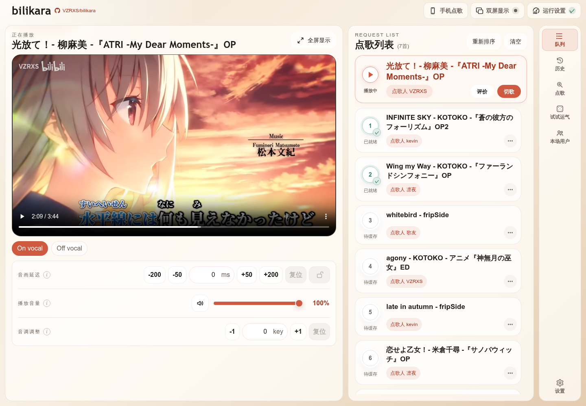 
  电脑播放与管理，手机参与点歌

## 开始使用

1. 从 [Releases](https://github.com/VZRXS/bilikara/releases) 下载并解压对应平台的完整包，Windows 打开 `bilikara-desktop.exe`，macOS 打开 `bilikara-desktop.app`。
2. 粘贴视频链接或 BV / av 号点歌，也可搜索和浏览曲库。歌曲缓存完成后开始播放。
3. 手机与电脑连接同一网络，打开电脑右上角「手机点歌」并扫码。异地使用时，先创建公网房间，再通过公网入口和房间密码连接。

macOS 首次打开被系统拦截时

先尝试打开 App，再前往「系统设置 → 隐私与安全性 → 安全性」，找到 Bilikara 并点击「仍要打开」，按系统提示确认。完成一次授权后即可正常启动。

手机无法连接时，请检查设备是否在同一网络、电脑防火墙是否放行；使用 VPN 或多网卡时，可尝试手机点歌菜单中的备用地址。

## 找歌与点歌

- **快速点歌**：支持视频链接、BV / av 号，以及夹杂 b23.tv 短链的分享文案；可点歌或顶到下一首。
- **搜索与发现**：搜索共享曲库或本地曲库，按类别、作品名、歌手浏览；点击封面查看歌曲详情。
- **来源与试试运气**：添加 UP 主和收藏夹，浏览已收录歌曲，或随机抽取一首。拉取期间可继续添加来源，任务会排队处理；失败后可手动重试。
- **分 P 与音轨**：选择视频画面和音频轨道，播放时随时切换原唱、伴奏等音轨。

<table>
  <tr>
    <td align="center" valign="top" width="50%">
      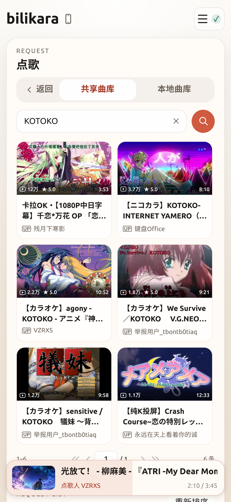 
      搜索歌曲
    </td>
    <td align="center" valign="top" width="50%">
      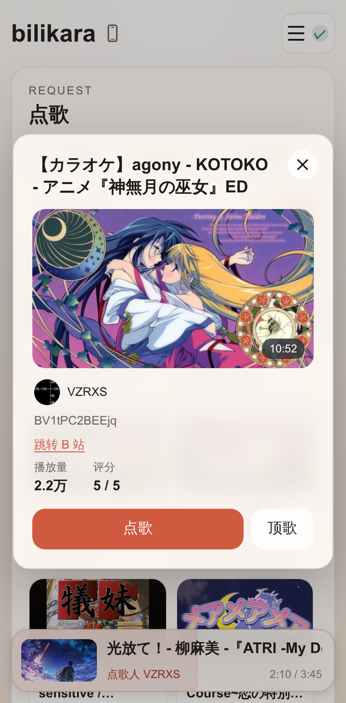 
      点击封面查看详情并点歌
    </td>
  </tr>
</table>

   
  发现 → 类别：向下滚动浏览更多主题

## 手机控制

扫码后，手机可以点歌、调整队列和控制播放。按住列表编号上下拖动排序，松手后确认；也可使用歌曲右侧菜单移除或顶歌。

<table>
  <tr>
    <td align="center" valign="top" width="50%">
      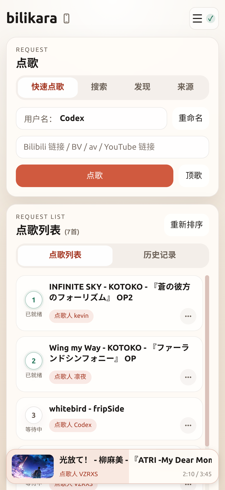 
      点歌与管理队列
    </td>
    <td align="center" valign="top" width="50%">
      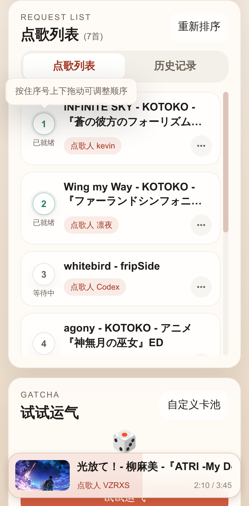 
      编号也是拖动入口
    </td>
  </tr>
</table>

点击底部播放栏展开控制抽屉，可暂停、切歌、前后跳转 15 秒、切换音轨，或调整音量、音画延迟和升降调。**从抽屉右上角「评价」进入视频打分**，为已播放的歌曲选择 1～5 星。

<table>
  <tr>
    <td align="center" valign="top" width="50%">
      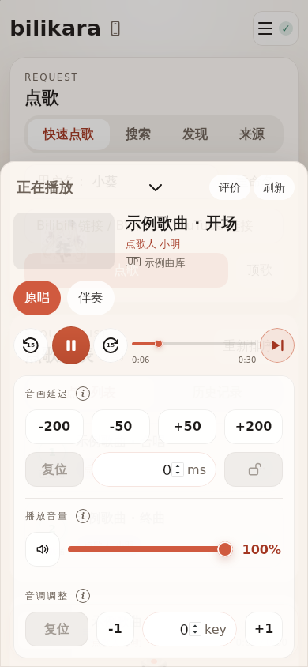 
      播放控制与评价入口
    </td>
    <td align="center" valign="top" width="50%">
      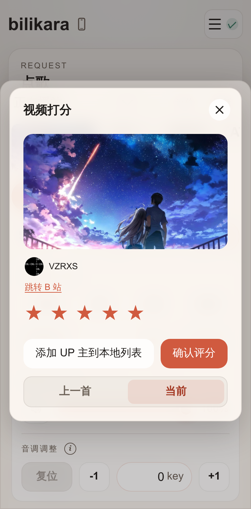 
      选择星级后确认评分
    </td>
  </tr>
</table>

## 本场用户

电脑的「本场用户」支持多选、批量拖动排序和删除，也可点击改名图标后选择用户修改名称。改名会同步到已连接的本地和公网手机；已有歌曲与历史保留点歌时的名字，之后点的歌使用新名字。

  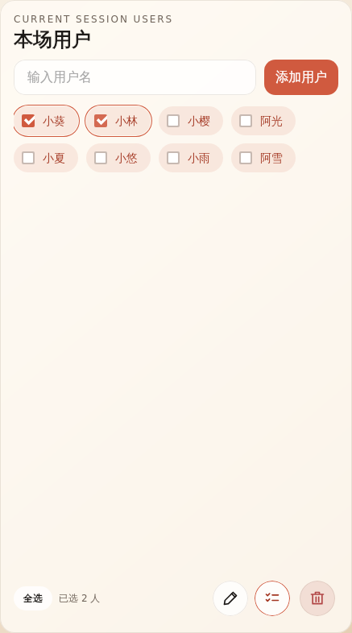

## 历史与歌单导出

历史记录保留点过的歌曲，方便重新点歌。进入 **「历史记录 → 导出」**，可将本场记录或全部历史保存为 CSV 或歌单图片；歌曲较多时可分成多张图片。

<table>
  <tr>
    <td align="center" valign="top" width="45%">
      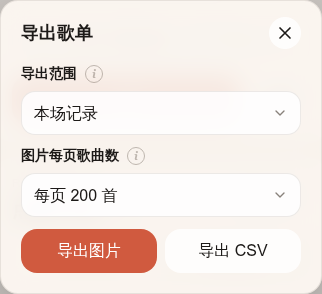 
      从历史记录页导出
    </td>
    <td align="center" valign="top" width="55%">
      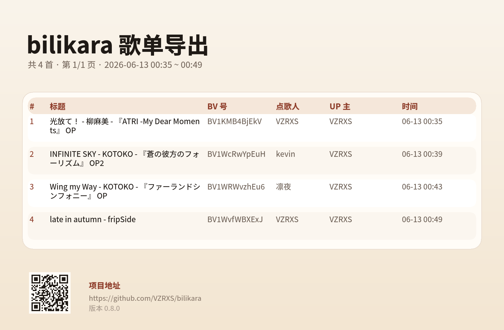 
      保存本场歌单
    </td>
  </tr>
</table>

## 全屏与双屏播放

单屏可直接全屏播放；连接电视或投影仪后，在右上角「双屏显示」中选择观众屏，电脑保留点歌与播放控制。可点击「识别屏幕」查看各屏编号。观众屏和全屏画面均可显示手机点歌二维码，其他人随时扫码加入；收到新点歌时，左上角会显示歌曲提示。

**双屏模式需在系统显示设置中选择「扩展」，不能使用「复制」或镜像模式。** Windows 可按 `Win + P` 选择「扩展」。

<table>
  <tr>
    <td align="center" valign="top" width="50%">
      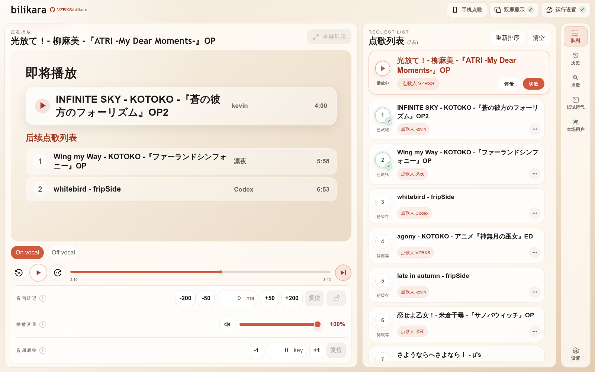 
      电脑操作屏
    </td>
    <td align="center" valign="top" width="50%">
      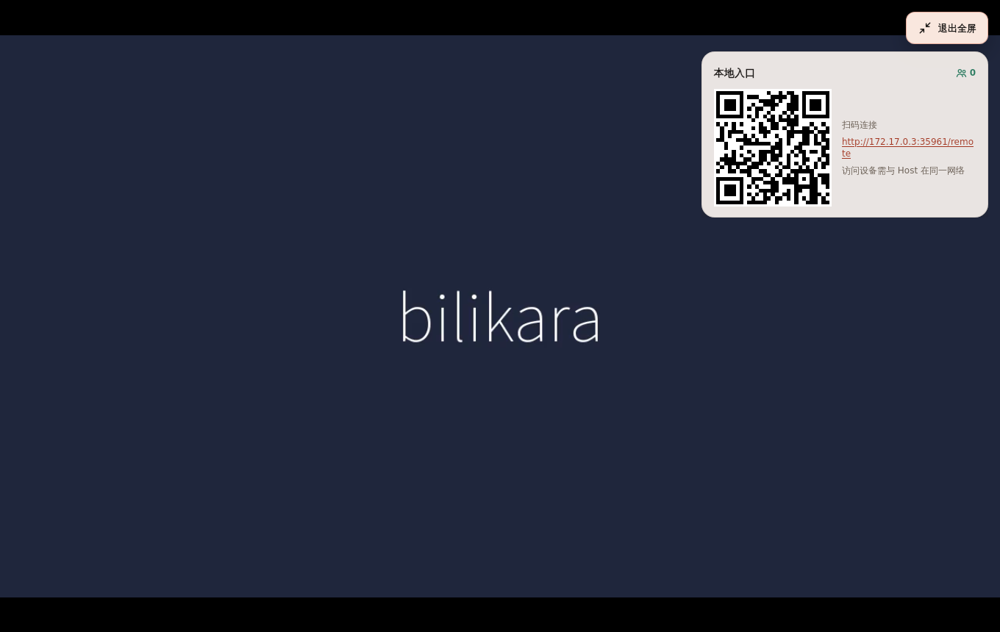 
      全屏播放：新点歌提示与扫码入口
    </td>
  </tr>
</table>

## 设置与维护

「运行设置」可扫码登录 Bilibili、选择清晰度与下载器、调整缓存数量和切歌延迟；「设置」可切换中英日语言、三种主题，以及检查更新、查看公告和导出诊断信息。

<table>
  <tr>
    <td align="center" valign="top" width="40%">
      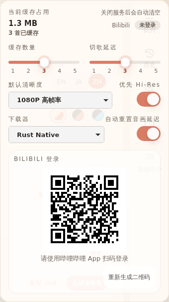 
      运行设置与扫码登录
    </td>
    <td align="center" valign="top" width="60%">
      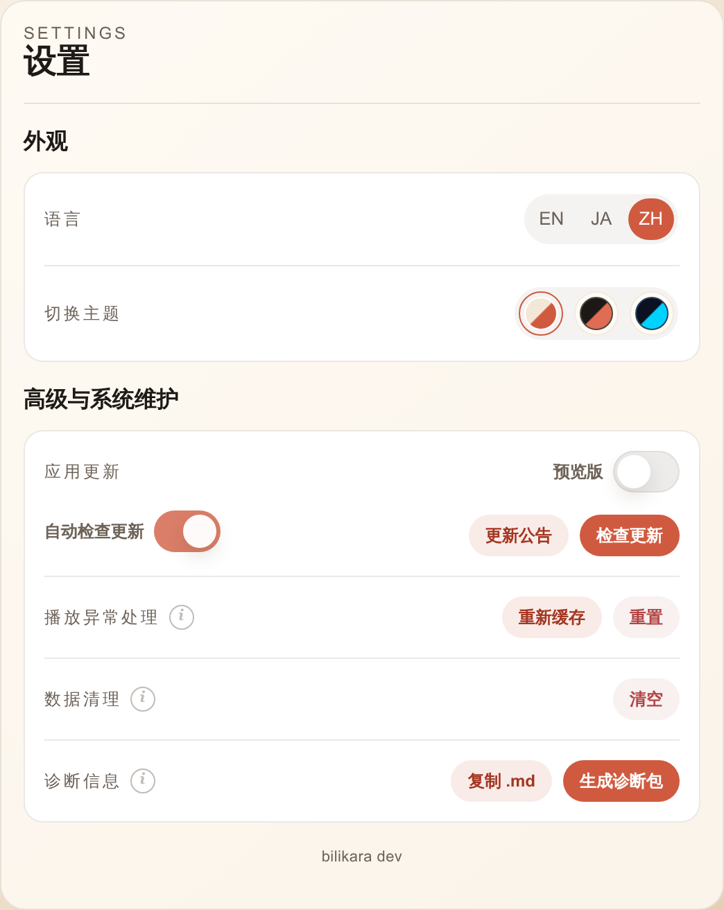 
      语言、外观与维护
    </td>
  </tr>
</table>

- 歌曲会提前缓存，失败后可重试；退出后清理播放缓存，歌单和播放器设置会保留。
- 默认使用内置 Rust Native，也可选择 BBDown 或 DownKyi / aria2c。Bilibili 登录二维码过期后自动刷新，凭据保存在本机，请勿分享登录凭据或完整数据目录。
- 遇到播放或启动问题，可在设置中导出诊断包。Windows 数据位于应用旁的 `runtime/data/`；macOS 位于 `~/Library/Application Support/bilikara/data/`。

## 开发

桌面版使用 Rust 后端与 Tauri 窗口，Host / Remote 共用网页界面。构建步骤、依赖和运行参数集中在以下文档：

- [原生桌面与本地构建](docs/native-desktop.md)
- [媒体依赖与打包](media-libav/PACKAGING.md) · [构建工作流](.github/workflows/ci-bundle.yml)
- [版本路线图](docs/version-roadmap.md) · [移动端架构](docs/mobile-host-rust-architecture.md) · [共享曲库](docs/shared-catalog.md)

## 致谢

- [BBDown](https://github.com/nilaoda/BBDown)
- [FFmpeg](https://github.com/FFmpeg/FFmpeg)

## License 与使用边界

本项目采用 [MIT License](LICENSE)。该许可仅适用于本项目自身的源代码和文档，不授予任何 B 站内容、音乐、视频、歌词、封面、字幕、公开播放、下载缓存、商业使用或第三方平台服务的授权。

`bilikara` 是用于本地 / 局域网卡拉 OK 点歌与播放管理的工具，不是 B 站下载器，也不应被作为视频、音频或其他平台内容的下载、保存、分发工具使用。

本地缓存仅服务于当前播放流程。服务退出后会自动清理已缓存内容；缓存媒体不属于本项目授权范围，相关权利仍归原权利人或对应平台所有。

使用者应自行确保使用场景符合相关法律法规、平台规则、版权要求，以及公开播放 / 商业使用所需的许可。请勿将本项目用于未经授权的下载、缓存、传播、公开播放、商业放映、规避访问限制、批量抓取或其他可能侵犯第三方权益或违反平台规则的用途。

更完整的法律边界、第三方工具说明和责任说明请阅读 [LEGAL.md](LEGAL.md) 和 [THIRD_PARTY_NOTICES.md](THIRD_PARTY_NOTICES.md)。
